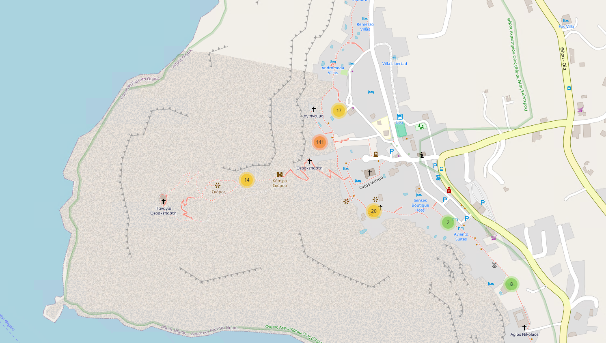

# Photo Location Mapper

This script allows you to map geotagged photos in a folder, providing an interactive map with photo locations and previews. With this tool, you can easily search for photos by location and view them on the map, making it convenient to rediscover past memories.

## Features
- **Location-Based Search:** Easily locate photos based on where they were taken.
- **Timeless Memories:** Rediscover old photos taken years ago in specific locations.
- **Grouping:** Photos on the map are grouped for easier navigation.
- **Photo Previews:** View thumbnail previews of each photo along with its full path.



## How to Use
1. **Install Required Python Packages:**
   ```bash
   pip install Pillow folium tqdm
   ```

2. **Set Target Folder:**
   - Set the `folder_path` variable in the script to the path containing geotagged images.

3. **Run the Script:**
   ```bash
   python photo_location_mapper.py
   ```

   The script will scan all photos in the target path and generate an HTML file named `photo_map.html`.

## Author
This script was authored by [aviado1](https://github.com/aviado1).

## Disclaimer
This script is provided as is, without warranty of any kind. Use at your own risk.
